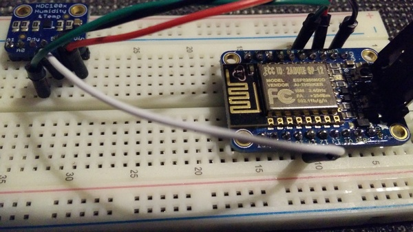

# iot-temp [![Travis][travis-img]][travis-url]

ESP8266 with temperature & humidity wireless sensor.

I use a huzzah ESP8266 and a HDC1008 from adafruit.



## Requirement

This project use PlatformIO, an open source ecosystem for IoT development
written in python. You can install it through pip :
```
pip install platformio
```

You need to setup a MQTT server too.

## Settings

On the first boot, the sensor will start a wireless to be configured.
You can follow the procedure from the [homie-esp8266 lib][homie-esp8266-doc-url].

## Compile

Compile the program with the following command :
```
platformio run
```

## Upload

On every upload, you need to put the ESP8266 in upload mode by pressing the
GPIO0 button and the reset button. The LED should be red.
To upload the compiled program to the ESP8266, use the following command :
```
platformio run --target upload
```

## Debug

To debug the program, you can get the serial output with the following
command :
```
platformio serialports monitor
```

[travis-img]: https://travis-ci.org/Damoun/iot-temp.svg
[travis-url]: https://travis-ci.org/Damoun/iot-temp/
[homie-esp8266-doc-url]: https://homie-esp8266.readme.io/docs/json-configuration-file
